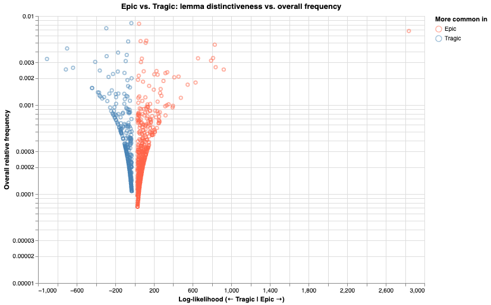

# ἔπεα τραγικά: Differentiating epic and tragedy through vocabulary

Aristotle's distinctions between epic and tragedy do not include vocabulary. He
comes closest to acknowledging a lexical difference when he notes how epic
meter better accommodates "unusual words" (_glōttas_) and metaphors: τὸ γὰρ
ἡρωοικὸν στασιμώτατον καὶ ὀγκωδέστατον τῶν μέτρωνγλώττας καὶ μεταφορὰς δέχεται
μάλιστα· περιττὴ γὰρ καὶ ἡ διηγηματικὴ μίμησις τῶν ἄλλων) (1459b34–37: For the
heroic (= epic hexameter) is the stateliest and weightiest of meters. That's
why it is especially receptive to unusual words [as opposed to a "proper word,"
ὄνομα κύριον; cf. 1457b1–4] and metaphors: for narrative re-enactment exceeds
the rest here too.^[Translations are my own unless otherwise noted. I borrow
"re-enactment" to translate μίμησις from @Nagy1996.]

But his focus here rests on meter, not on vocabulary. Nevertheless, critics
from antiquity to the present have noted moments of so-called "epic diction" in
certain scenes of Attic tragedy. To take an ancient example, the scholia on
Sophocles' _Ajax_ note parallels between Tecmessa's scene with Ajax and a
unique view of domestic life in Homer's _Iliad_, the scene between Andromache
and Hector in _Iliad_ 6.^[These parallels are the focus of @Easterling1984.]
For a modern example, Justina Gregory writes, "Of the three fifth-century
tragedians Sophocles is by general consent regarded as the most beholden to
Homer, and within Sophocles' surviving oeuvre _Ajax_ is rightly deemed the most
Homeric" ([@Gregory2017 137]). She cites P. E. Easterling's 1984 article, "The
Tragic Homer," in support of this argument. Easterling's article begins, "It
was a cliché of ancient literary criticism that Sophocles was 'most Homeric':
Polemo put the idea epigrammatically when he said Homer was the epic Sophocles
and Sophocles the tragic Homer" ([@Easterling1984 1]). While such assertions of
Homericness in tragedy surely have merit, they have generally resisted
quantification, and their sometimes impressionistic nature has made it
difficult to compare such assertions across tragedies and/or tragedians. In
this paper, I present a quantitative and computational approach to this
question, showing how such an examination the "Homericness" of tragic passages
enriches our understanding of ancient literary and performance traditions while
also opening up potential new avenues of inquiry.

<https://penelope.uchicago.edu/Thayer/E/Roman/Texts/Dio_Chrysostom/Discourses/52*.html>
<https://penelope.uchicago.edu/Thayer/E/Roman/Texts/Dio_Chrysostom/Discourses/53*.html>

## Prior art

Easterling quickly qualifies the cliché that opens "The Tragic Homer": "But
there are ... striking ways in which Sophocles departs from his epic models....
Most important of all, the language he uses is highly synthetic: it may feel
'most Homeric' but it betrays a keen awareness both of other literature and of
contemporary life" ([@Easterling1984 1]). In many ways, this paper picks up
from here, measuring language _per se_ of Homer and tragedy, rather than
tragedy's allusions to Homer—which appear frequently and have received much
scholarly attention.^[To take two recent examples, Amelia Bensch-Schaus shows
how Sophocles builds the title character of his _Ajax_ from two distinct
portrayals of the "second-best of the Achaeans," namely the portrayal in the
_Iliad_ versus his silent portrayal among the shades in the _Odyssey_
([@Bensch-Schaus2025]). Maria Serena Mirto, contrastingly, shows how Euripides'
_Heracles_ breaks from the mythological and Homeric tradition with its
manipulation of the title character's paternity ([@Mirto2025]).] This paper thus
concerns itself less with tracking Homer's influence on tragedy and more with
the evolution of tragic language and its debts to Homer's language.

## Methodology

To begin, I used the Conference on Computational Natural Language Learning
Universal (CoNLL-U) encoding of the treebanks of Homer's _Iliad_ and _Odyssey_
from Francesco Mambrini's Daphne project ([@Mambrini.Daphne]). Treebanks are
richly annotated texts containing morphological information—including
lemmata—for each token. Because not all tragedies have hand-annotated
treebanks, the tragic corpus was lemmatized using the natural language
processing library Stanza ([@Stanza]). (Using the CoNLL-U treebanks for
tragedies when available but falling back to automatic lemmatization with
Stanza would have led to data compatibility issues, so for the sake of
consistency stanza was used for all tragedies.) Lemmatized forms were used
rather than the inflected forms to help control for differences of dialect. The
different meters of Homer and tragedy—dactylic hexameter and a mix of iambic
and lyric meters, respectively—mean that bag-of-words models help to avoid
potential syntactic pitfalls associated with different word order necessitated
by different meter.

Lemmata were subsequently used to build multi-indexed document-term matrices
(DTMs) in Pandas, a Python library for data manipulation. All code used in
these analyses is available in the following
[repository](https://github.com/pletcher/ccc-2026). Each row in a DTM
represents a lemma, with columns representing dramatist, play title, and
speaker. The value at the intersection of each row and column is the absolute
(raw) frequency that a given lemma appears in the work, speaker, or playwright
associated with the column. Similar DataFrames (the Pandas term for the data
structure employed here) were prepared for Homer, with one row per lemma and
columns for each epic.

To calculate the "Homericness" of each lemma, the Dunning G^2 log-likelihood
ratio of it appearing in tragedy versus it appearing in epic was calculated
([@Dunning1993]). Positive values mean that a lemma skews more Homeric;
negative values indicate the it tends to appear more frequently in tragedy.
The top 10 lemmata for each genre are reproduced in tabular form below.

Top lemmata for tragedy:

| lemma  | G^2     |
| ------ | ------- |
| λόγος  | -895.87 |
| θνήσκω | -712.01 |
| εἷς    | -699.07 |
| γῆ     | -637.00 |
| ποός   | -441.74 |
| οὖς    | -439.47 |
| τέκνον | -408.69 |
| δράω   | -380.89 |
| τάλας  | -368.26 |
| ἰώ     | -364.52 |

Top lemmata for epic

| lemma    | G^2    |
| -------- | ------ |
| υἱός     | 922.17 |
| Τρώς     | 838.73 |
| ναῦς     | 829.65 |
| θυμός    | 812.04 |
| Ὀδυσσεύς | 791.25 |
| Ἀχαιός   | 656.00 |
| ἑταῖρος  | 630.88 |
| δῖος     | 549.13 |
| μέγαρον  | 478.45 |
| ἵππος    | 454.94 |

For lemmata as heavily differentiated as these, p-values approach 0, indicating
high statistical significance. Proper nouns help to differentiate epic from tragedy:
Ἕκτωρ and Τηλέμαχος have the 11th and 12th highest log-likelihood ratios for epic,
following the pattern established by Ὀδυσσεύς and Ἀχαιός. Tragedy, unsurprisingly, is
distinguished by the attention that it pays to speech (λόγος) and action (δράω).

We can also visualize this differentiation in the following fountain graph, which
plots the most significant lemmata by relative frequency and log-likelihood,
demonstrating a clear delineation between epic and tragedy.

