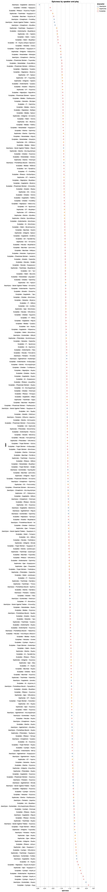
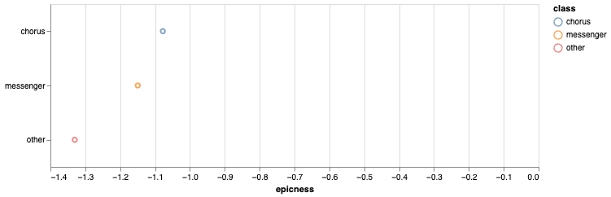

# ἔπεα τραγικά: Differentiating epic and tragedy through vocabulary

## Introduction

In a recent monograph on the chronology of early Greek hexameter poetry, Tom McConnell employs
statistical and linguistic methods to investigate changes over time in Homer and Hesiod. In a
chapter on Homeric speech and narrative, McConnell gestures towards a general lack of precision
in the discussion of the differences between speech and narrative, a lack that his chapter goes
a long way towards remedying ([@McConnell2025 166]). He finds by way of conclusion that Homeric
speech shows greater variability in its content than Homeric narrative (although this is not
to say that Homeric narrative does not vary its content), suggesting greater flexibility during
"recomposition-in-performance," an idea that he borrows from Alfred Lord's work on South Slavic
song and that bears some resemblance to the work of Gregory Nagy ([@McConnell2025 182–183]). As
McConnell's bibliography attests, the work on the differences between Homeric speech and narrative
is abundant, including seminal articles like Adam Parry's 1956 "The Language of Achilles";
Jasper Griffin's 1986 "Homeric Words and Speakers"; and Margalit Finkelberg's 1989 "Formulaic
and Nonformulaic Elements in Homer." This large—and, as McConnell's contributions demonstrate,
growing—body of work makes it challenging to find an entrypoint, even when we have a new tool like
the Digital Initiative for Classics: Epic Speeches (DICES) database. Nevertheless, we can profit
from using these new tools to verify previous claims and perhaps start formulating new ones.

I divide this paper in two disjointed parts: in the first part, I demonstrate the use of the
DICES database by incorporating it into corraborating some of Griffin's claims. This talk focuses
on the use of DICES to compare speech and narrative in Homer. In the second part, I turn to a
different sort of speech-narrative comparison between epic and tragedy, borrowing many of the same
methods from the first part and applying them to different registers. My aim is to show how such
examinations of "Homericness"—both within Homer and within what we might call Homeric reception—
enrich our understanding of ancient literary and performance traditions while also opening up new
avenues of inquiry.

## Epic and the reception of its language in tragedy

Aristotle's distinctions between epic and tragedy do not include vocabulary. He comes closest
to acknowledging a lexical difference when he notes how epic meter better accommodates "unusual
words" (_glōttas_) and metaphors: τὸ γὰρ ἡρωοικὸν στασιμώτατον καὶ ὀγκωδέστατον τῶν μέτρωνγλώττας
καὶ μεταφορὰς δέχεται μάλιστα· περιττὴ γὰρ καὶ ἡ διηγηματικὴ μίμησις τῶν ἄλλων) (1459b34–37:
For the heroic (= epic hexameter) is the stateliest and weightiest of meters. That's why it is
especially receptive to unusual words [as opposed to a "proper word," ὄνομα κύριον; cf. 1457b1–4]
and metaphors: for narrative re-enactment exceeds the rest here too.^[Translations are my own unless
otherwise noted. I borrow "re-enactment" to translate μίμησις from @Nagy1996.]

But his focus here rests on meter, not on vocabulary. Nevertheless, critics from antiquity to the
present have noted moments of so-called "epic diction" in certain scenes of Attic tragedy. To take
an ancient example, the scholia on Sophocles' _Ajax_ note parallels between Tecmessa's scene with
Ajax and a unique view of domestic life in Homer's _Iliad_, the scene between Andromache and Hector
in _Iliad_ 6.^[These parallels are the focus of @Easterling1984.] For a modern example, Justina
Gregory writes, "Of the three fifth-century tragedians Sophocles is by general consent regarded
as the most beholden to Homer, and within Sophocles' surviving oeuvre _Ajax_ is rightly deemed the
most Homeric" ([@Gregory2017 137]). She cites P. E. Easterling's 1984 article, "The Tragic Homer,"
in support of this argument. Easterling's article begins, "It was a cliché of ancient literary
criticism that Sophocles was 'most Homeric': Polemo put the idea epigrammatically when he said
Homer was the epic Sophocles and Sophocles the tragic Homer" ([@Easterling1984 1]). While such
assertions of Homericness in tragedy surely have merit, they have generally resisted quantification,
and their sometimes impressionistic nature has made it difficult to compare such assertions across
tragedies and/or tragedians.

<https://penelope.uchicago.edu/Thayer/E/Roman/Texts/Dio_Chrysostom/Discourses/52*.html>
<https://penelope.uchicago.edu/Thayer/E/Roman/Texts/Dio_Chrysostom/Discourses/53*.html>

## Prior art

Easterling quickly qualifies the cliché that opens "The Tragic Homer": "But
there are ... striking ways in which Sophocles departs from his epic models....
Most important of all, the language he uses is highly synthetic: it may feel
'most Homeric' but it betrays a keen awareness both of other literature and of
contemporary life" ([@Easterling1984 1]). In many ways, this paper picks up
from here, measuring language _per se_ of Homer and tragedy, rather than
tragedy's allusions to Homer—which appear frequently and have received much
scholarly attention.^[To take two recent examples, Amelia Bensch-Schaus shows
how Sophocles builds the title character of his _Ajax_ from two distinct
portrayals of the "second-best of the Achaeans," namely the portrayal in the
_Iliad_ versus his silent portrayal among the shades in the _Odyssey_
([@Bensch-Schaus2025]). Maria Serena Mirto, contrastingly, shows how Euripides'
_Heracles_ breaks from the mythological and Homeric tradition with its
manipulation of the title character's paternity ([@Mirto2025]).] This paper thus
concerns itself less with tracking Homer's influence on tragedy and more with
the evolution of tragic language and its debts to Homer's language.

## Methodology

To begin, I used the Conference on Computational Natural Language Learning
Universal (CoNLL-U) encoding of the treebanks of Homer's _Iliad_ and _Odyssey_
from Francesco Mambrini's Daphne project ([@Mambrini.Daphne]). Treebanks are
richly annotated texts containing morphological information—including
lemmata—for each token. Because not all tragedies have hand-annotated
treebanks, the tragic corpus was lemmatized using the natural language
processing library Stanza ([@Stanza]). (Using the CoNLL-U treebanks for
tragedies when available but falling back to automatic lemmatization with
Stanza would have led to data compatibility issues, so for the sake of
consistency stanza was used for all tragedies.) Lemmatized forms were used
rather than the inflected forms to help control for differences of dialect. The
different meters of Homer and tragedy—dactylic hexameter and a mix of iambic
and lyric meters, respectively—mean that bag-of-words models help to avoid
potential syntactic pitfalls associated with different word order necessitated
by different meter.

Lemmata were subsequently used to build document-term matrices (DTMs) in
Pandas, a Python library for data manipulation. All code used in these analyses
is available in the following
[repository](https://github.com/pletcher/ccc-2026). Each row in a DTM
represents a lemma, with columns representing dramatist, play title, and
speaker. The value at the intersection of each row and column is the absolute
(raw) frequency that a given lemma appears in the work, speaker, or playwright
associated with the column. Similar DataFrames (the Pandas term for the data
structure employed here) were prepared for Homer, with one row per lemma and
columns for each epic.

To calculate the "Homericness" or "epicness" (I use these terms
interchangeably) of each lemma, first the Dunning G^2 log-likelihood ratio of
it appearing in tragedy versus it appearing in epic was calculated
([@Dunning1993]). Positive values mean that a lemma skews more Homeric;
negative values indicate the it tends to appear more frequently in tragedy. The
top 10 lemmata for each genre are reproduced in tabular form below.

Top lemmata for tragedy:

| lemma  | G^2     |
| ------ | ------- |
| λόγος  | -895.87 |
| θνήσκω | -712.01 |
| εἷς    | -699.07 |
| γῆ     | -637.00 |
| ποός   | -441.74 |
| οὖς    | -439.47 |
| τέκνον | -408.69 |
| δράω   | -380.89 |
| τάλας  | -368.26 |
| ἰώ     | -364.52 |

Top lemmata for epic

| lemma    | G^2    |
| -------- | ------ |
| υἱός     | 922.17 |
| Τρώς     | 838.73 |
| ναῦς     | 829.65 |
| θυμός    | 812.04 |
| Ὀδυσσεύς | 791.25 |
| Ἀχαιός   | 656.00 |
| ἑταῖρος  | 630.88 |
| δῖος     | 549.13 |
| μέγαρον  | 478.45 |
| ἵππος    | 454.94 |

For lemmata as heavily differentiated as these, p-values approach 0, indicating high statistical
significance. Proper nouns help to differentiate epic from tragedy: Ἕκτωρ and Τηλέμαχος have the
11th and 12th highest log-likelihood ratios for epic, following the pattern established by Ὀδυσσεύς
(5th) and Ἀχαιός (6th). Tragedy, unsurprisingly, is distinguished by the attention that it pays to
speech (λόγος, 1st most distinctive) and action (δράω, 8th).

We can also visualize this differentiation in the following fountain graph, which plots the most
significant lemmata by relative frequency and log-likelihood, demonstrating a clear delineation
between epic and tragedy.

Dunning's G^2 provides a readily interpretable statistic for a lemma's epic or tragic keyness, but
it does not provide a way to compare across dramatists, speakers, or lines. For these comparisons,
we resort to a Naive Bayes classifier, keeping the negative=tragedy, positive=Homer axis but instead
calculating the frequency-weighted likelihood of a lemma appearing in either genre. I borrow this
method from Frederick Mosteller and David Wallace's well-known study of the _Federalist Papers_
([@Mosteller.Wallace1984]). Although my study has no authorship dispute to settle between Homer and
the tragedians, the use of per-lemma Naive Bayes log-odds, rather than frequency-weighted Dunning's
G^2, gives us a statistic that we can average across dramatists, plays, and speakers, or sum across
lines. (We sum, rather than average, lines because they are already length-normalized; we average
the other scores to control for length.)

Making the naive assumption that all tokens appear independently—that our documents can truly be
represented as "bags of words"—is not without problems, especially when it comes to multi-word
epic formulae. The result, however, boils down to over-counting in favor of epic, which amounts
to how we read such formula anyway. Put another way, even under assumptions of independence that
we as classicists know do not hold, the data show strong enough differentiation that we can make
inferences from it. Mosteller and Wallace encountered a similar problem with their study of the
_Federalist Papers_: "Independence is an impossibly stiff condition to achieve or justify, and the
reader has as many reasons as we for not believing in it" ([@Mosteller.Wallace1984 155]). In a long
and technical discussion which I do not have space to cover in full here, Mosteller and Wallace show
that their use of log-odds yields results that justify the assumption of independence, even when
we know from experience that the assumption does not hold. In terms of epic versus tragedy, their
formula ([@Mosteller.Wallace1984 195]) could be expressed as

$$\lambda(w) = \log \frac{P(w \mid \text{epic})}{P(w \mid \text{tragedy})}$$

where $\lambda(w)$ is the epicness score for a word $w$, and $P(w \mid \text{epic})$ and $P(w \mid
\text{tragedy})$ are the probabilities that a word appears in epic and tragedy, respectively.

## Results

When we plot the "epicness" scores against the probable dates of each tragedy, we see a small
but measurable decrease in epicness over time. The changes by dramatist, while overall less
statistically significant (p > 0.5), will nevertheless not surprise classicists: Euripides alone
appears to grow _more_ epic over time, perhaps owing to his well-attested penchant for archaizing
language.

Zooming in on epicness by speaker, we see that all speakers use more tragic than epic language—
unsurprisingly, given the generic and metrical constraints of the performance medium.

What is surprising, however, is that when we group by speaker class—"chorus," "messenger", or
"other"—choruses speak with the least tragic language, followed by messengers. This result perhaps
harks back to the importance of space and proper nouns in epic, with the chorus picking up those
propensities in tragedy.

## Interpreting by line, at scale

I have built a small reading environment for the corpus of Attic tragedy which enables visualizing
the aggregate epicness by line while reading a given tragedy. This visualization is a static site
built using many of the same tools that the new Perseus Digital Library will use; it is hosted at
the following URL: <https://pletcher.github.io/ccc-2026-web/>

### Case Study 1: Aeschylus' _Suppliants_

### Case Study 2: Sophocles' _Ajax_

### Case Study 3: Euripides' _Heracles_

### Case Study 4: Sophocles' _Electra_

## Conclusion
